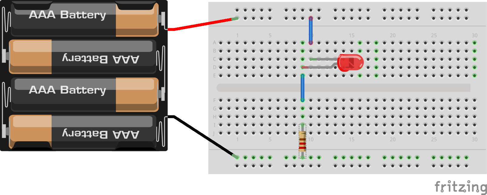

#Breadboards

To make circuits quickly, people use something called a Breadboard, or more accurately, a Solderless Breadboard.

Breadboards are a way of constructing electronics without having to use a soldering iron. Components are pushed into the sockets on the breadboard and then extra 'jumper' wires are used to make connections.

If you were to pull the self adhesive backing off the back of your breadboard, it would look something like this.

The middle section of the board has two columns, each with 30 strips of connector, like the one pulled out and to the side of the breadboard. These connect together anything that is pushed through from the front into one of those five holes.

On either edge of the board are much longer sections of clip that join together the columns of holes marked by the blue and red lines on the front of the breadboard. These are generally used for GND (blue) and 5V (red).

For our first circuit, we'll simply be making a circuit light up. Copy the circuit in this image to your breadboard:

Note that the direction you plug your LED in matters. Make sure the long end of the component matches the ciruit drawing.

Now try adding another LED in series. In parallel. What happens? You might see that it doesn't behave like you would expect. Some LED's might be brighter than others. Why? It's complicated, but short answer is that LED's don't behave like we saw earlier. V=IR isn't enough to describe the behavior of LED's. It's confusing, but we won't delve into the laws of diodes in this workshop. For the most part, however, if you have one LED, increasing voltage/current will increase the brightness

What if you change the value of the resistor? (Don't go below 100 ohms! You might burn out the LED's :O )

Next, let's use Arduinos. We haven't introduced them formally yet, but this is a cool demo. Follow the intructions here, for the "photoresistor" one:

[https://www.arduino.cc/en/Tutorial/AnalogInput](https://www.arduino.cc/en/Tutorial/AnalogInput)

Now try this similar demo, now using flex sensors!

[http://www.theorycircuit.com/flex-sensor-with-arduino/](http://www.theorycircuit.com/flex-sensor-with-arduino/)

Here is a circuit we'll use in our final project:

[https://learn.sparkfun.com/tutorials/sik-experiment-guide-for-arduino---v32/experiment-9-using-a-flex-sensor](https://learn.sparkfun.com/tutorials/sik-experiment-guide-for-arduino---v32/experiment-9-using-a-flex-sensor)

